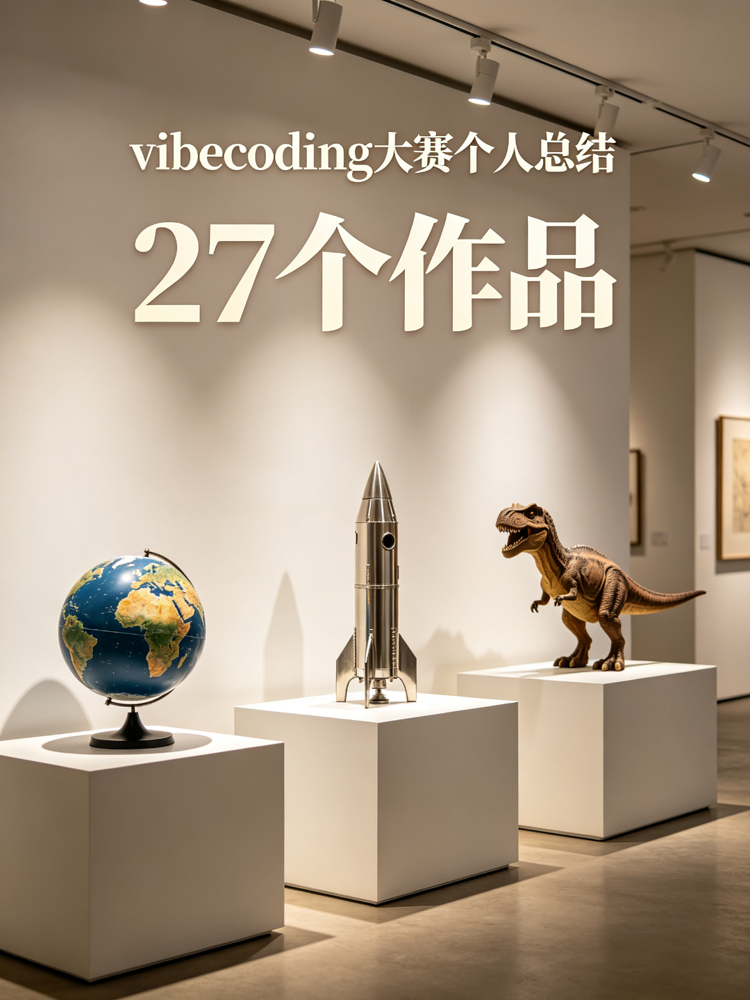
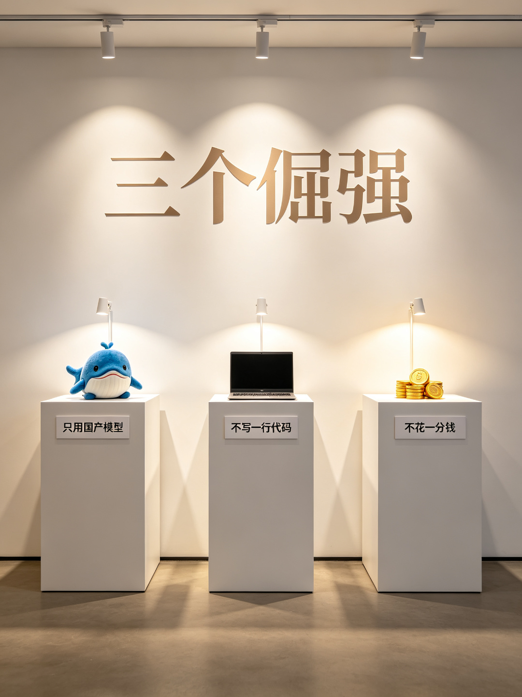
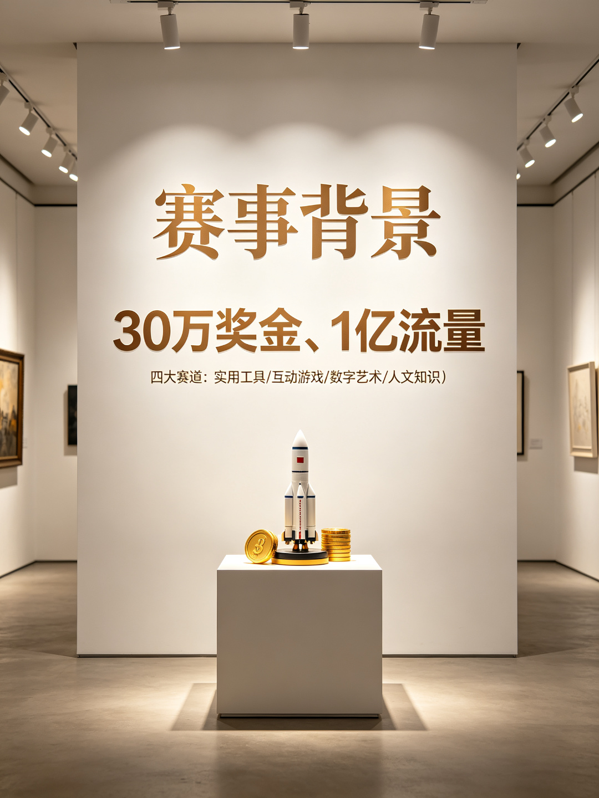
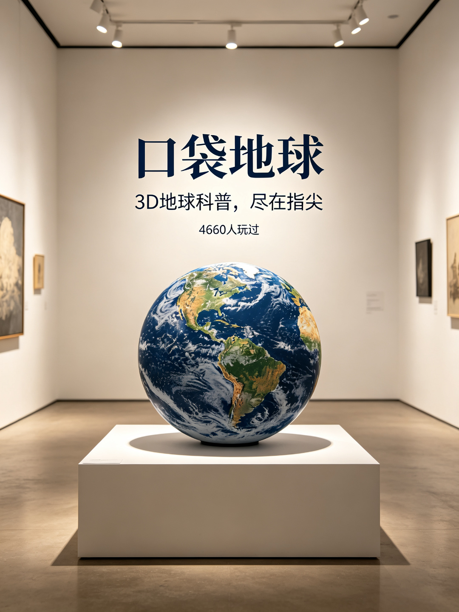
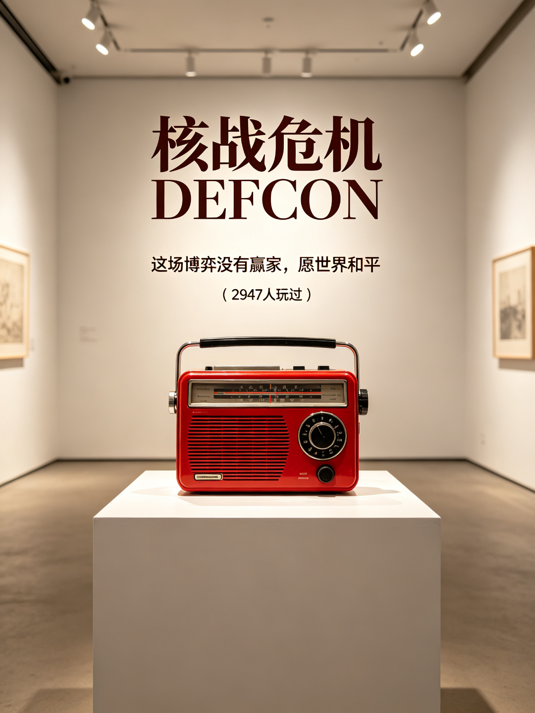
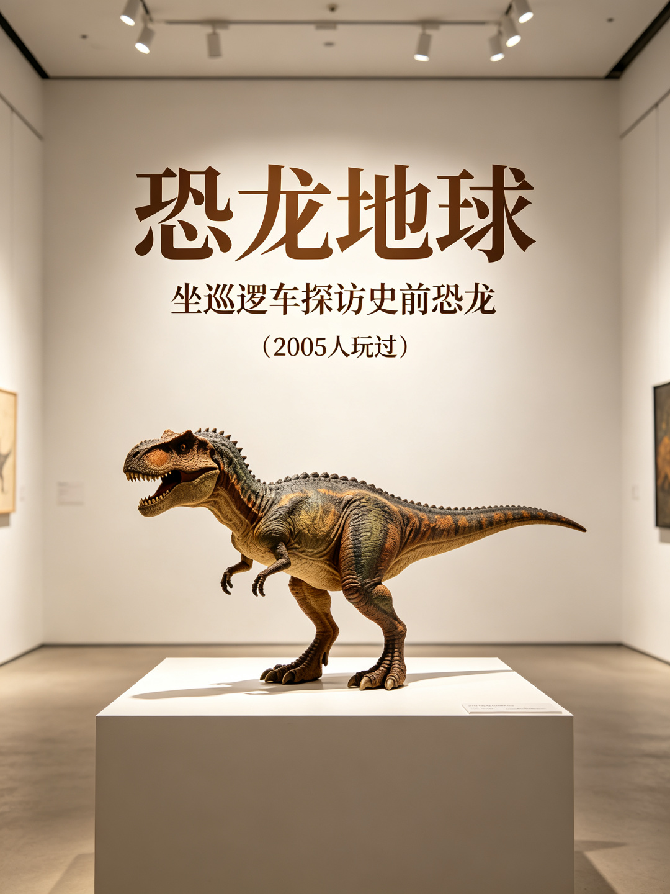
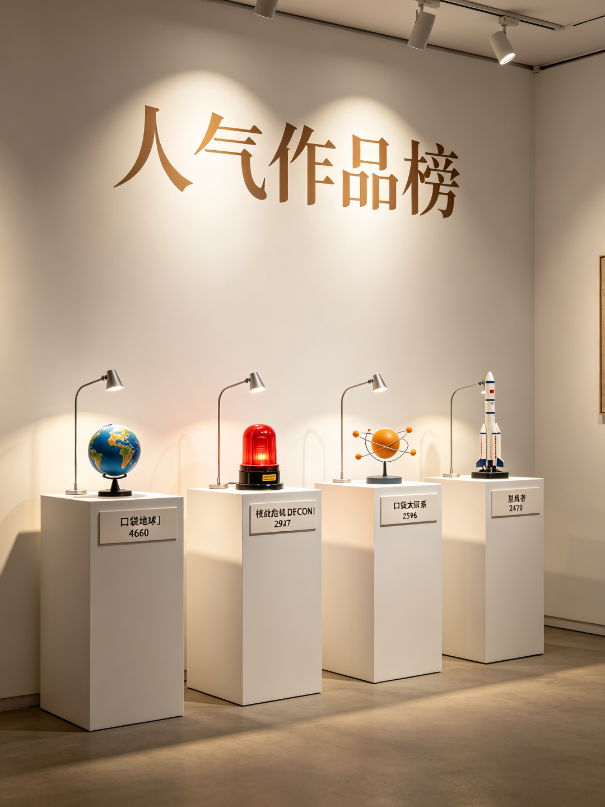
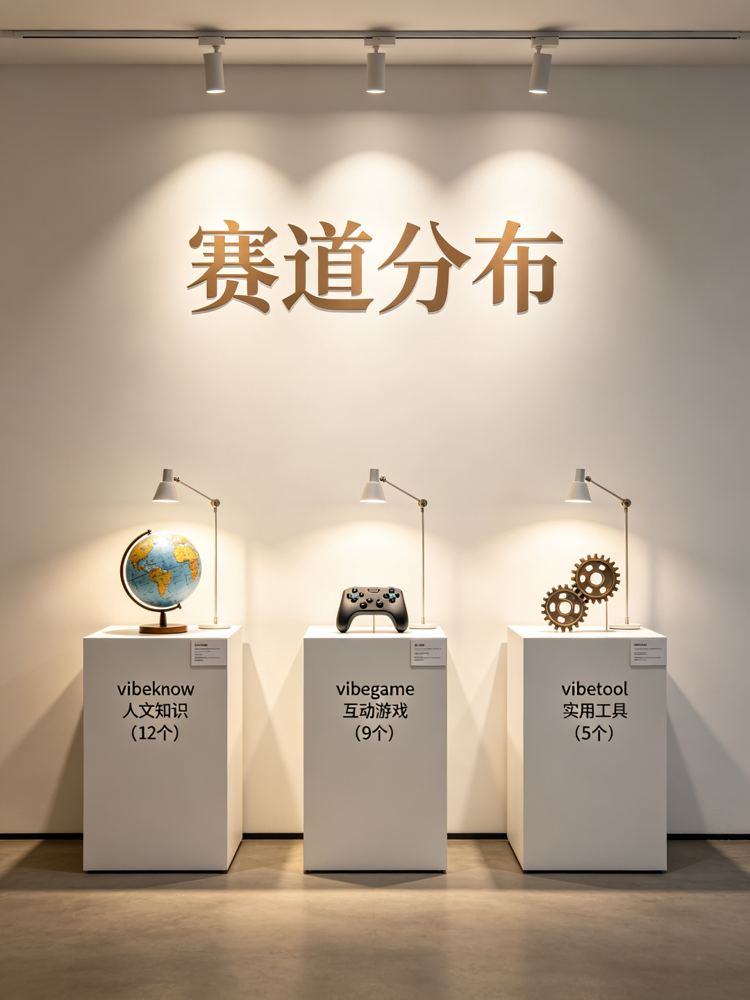
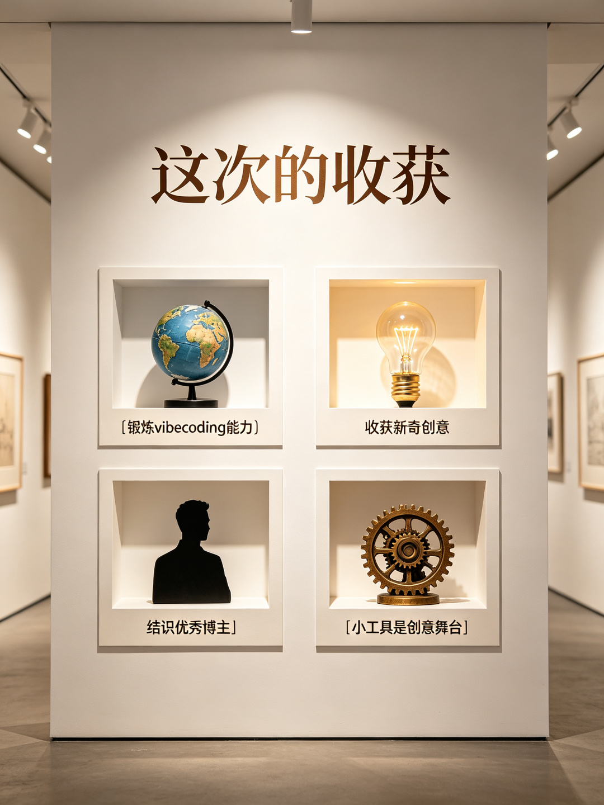
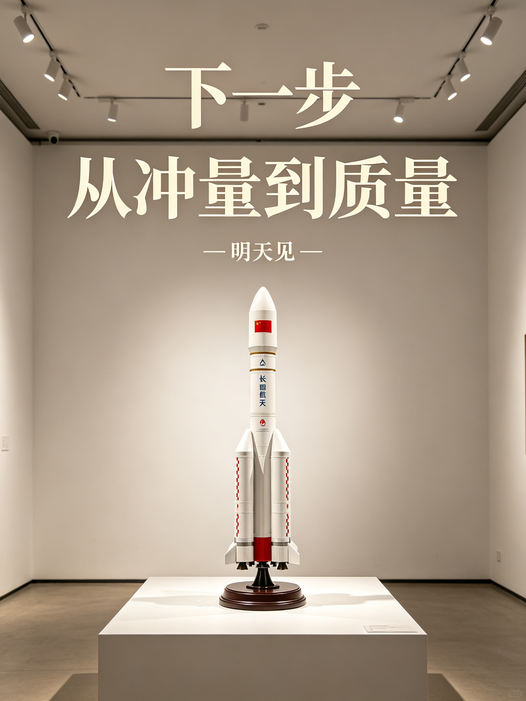

# 小红书图文笔记｜vibecoding大赛个人总结

> 归档目录：`xhs-vibecoding大赛总结/`，配图见 `images/` 子目录，均为 1080×1440（3:4 竖版）。

---

## ✨ 一、笔记标题

**主标题（20字符，核心关键词前置）：**

> vibecoding大赛个人总结｜27个作品📕

---

## 🖼️ 二、笔记配图（共 10 张，杂志风高信息密度介绍图，3:4 竖版）

艺术馆展陈风 10 张（暖白艺术馆墙 + 写实摄影展品 + 白色展台 + 柔和展厅射灯 + 展签说明，每张聚焦一个点，数据来自应用清单-关联项目表）：
1. 总览：27个作品
2. 三个倔强：只用国产模型（DeepSeek蓝鲸鱼）/ 不写一行代码 / 不花一分钱
3. 赛事背景：30万奖金 / 1亿流量 / 四大赛道
4. 口袋地球：3D地球科普，尽在指尖，4660人玩过
5. 核战危机DEFCON：这场博弈没有赢家，愿世界和平，2947人玩过
6. 恐龙地球：坐巡逻车探访史前恐龙，2005人玩过
7. 人气榜 Top4：口袋地球4660 / 核战危机2947 / 口袋太阳系2596 / 星航者2470
8. 赛道分布：vibeknow人文知识12个 / vibegame互动游戏9个 / vibetool实用工具5个
9. 收获：锻炼能力 / 新奇创意 / 结识博主 / 小工具是创意舞台
10. 下一步：从冲量到质量，明天见

> 注：原 6 张清新柔和风主图（封面 / 赛事背景 / 作品成绩 / 三个倔强 / 比赛收获 / 未来规划）与介绍 11、12 两张未发布，已从 `images/` 删除；本归档仅保留已发布的 10 张介绍图。

---

## 📝 三、正文内容（可读版）

**开头钩子（结果+身份）：** 一行代码没写、一分钱没花，我在小红书 vibecoding 大赛做了 27 个小工具。比赛收官，来交一份个人总结。

**1、先说说这场大赛的背景和特色**

小红书 vibecoding 大赛，本质是「用 AI 编程的方式，把创意做成可交互的小工具」：作品上传为小红书小工具、挂载在笔记里，谁都能点开就玩。官方带了 30 万奖金和 1 亿专项流量，分四个赛道——vibetool 实用工具、vibegame 互动游戏、vibeart 数字艺术、vibeknow 人文知识。最有魅力的点在于：小工具是动态、可交互的，它让创意「活」了起来，而不是一张静态图。

**2、我的参赛：27 个作品**

这次一共发布了 27 个作品，横跨多个赛道。几个记忆点：最用心的作品是「核战危机DEFCON」——这场博弈没有赢家，愿世界和平；最受用户欢迎的是「口袋地球」，3D 地球科普，有近 5000 人玩过；最受欢迎笔记是「恐龙地球（侏罗纪公园）」，坐巡逻车探访史前恐龙。

27 个作品横跨三赛道：vibeknow 人文知识 12 个、vibegame 互动游戏 9 个、vibetool 实用工具 5 个。人气最高的是口袋地球，4660 人玩过；核战危机DEFCON 2947、口袋太阳系 2596、星航者 2470、恐龙地球 2005 紧随其后。

**3、我给自己立的三个小倔强**

① 只用国产模型；② 不手写一行代码；③ 不花一分钱（单指词元费用）。三个都做到了。

**4、比赛的收获**

① 锻炼了自己的 vibecoding 能力；② 收获了很多新奇的创意和方法；③ 认识了一些优秀的小红书博主——明天会专门出一篇笔记介绍他们的作品和博主，欢迎蹲；④ 更深地体会到：小工具真的是展示创意的好载体，动态可交互，比静态内容更有生命力。

**5、未来的规划**

从「冲量」转向「质量」，不急着堆数量，好好打磨几个优质作品。

**结尾动作：** 你玩过我的哪个作品？评论区聊聊，明天优秀博主盘点赞我蹲住～

---

## ✨ 四、直接复制版本（发布用，直接粘贴到小红书）

一行代码没写、一分钱没花，我在小红书 vibecoding 大赛做了 27 个小工具🔧

比赛收官，来交一份个人总结👇

先说说大赛背景。这是小红书发起的 vibecoding 大赛：用 AI 编程把创意做成「小工具」，挂在笔记里谁都能点开玩，分实用工具、互动游戏、数字艺术、人文知识四个赛道。最特别的是，小工具是动态可交互的，创意不是一张静态图，而是真的能玩起来✨

这次我一共发布了 27 个作品，也给自己立了三个小倔强：
1、只用国产模型
2、不手写一行代码
3、不花一分钱（单指词元费用）
三个都做到了，还挺骄傲的哈哈。

记录几个作品的小成绩：
最用心的作品：核战危机DEFCON，一场没有赢家的博弈，愿世界和平🕊️
最受用户欢迎：口袋地球，3D 地球科普，近 5000 人玩过🌍
最受欢迎笔记：恐龙地球，坐巡逻车探访史前恐龙🦕

比赛的收获比想象中多：
1、锻炼了自己的 vibecoding 能力
2、收获了很多新奇的创意和方法
3、认识了一些优秀的小红书博主，明天专门出一篇笔记介绍他们的作品和博主，蹲住！
4、也更确信：小工具真的是展示创意的好载体，动态、可交互，比静态内容有生命力多了

接下来的规划：从冲量转向质量，不急着堆数量，好好打磨几个优质作品。
感谢小红书，感谢每一个玩过我作品的人🙏

明天见～

#小红书vibecoding大赛  #vibecoding  #小红书小工具  #REDSkill #buildwithqwen  #happyqwensday

---

## 💡 五、标题备选

- **数字型：** ① vibecoding大赛，27个作品0行代码 ② vibecoding大赛，我用0成本做了27个作品
- **成长型：** ③ vibecoding大赛收官，我的4点收获 ④ vibecoding大赛复盘：从冲量到打磨
- **反常识型：** ⑤ 一行代码没写，我在小红书做了27个小工具 ⑥ 不写代码不花钱，我的vibecoding参赛总结
- **悬念型：** ⑦ vibecoding大赛结束，我守住了三个倔强
- **身份型：** ⑧ 一个不写代码的人，参加vibecoding大赛的总结
- **对比型：** ⑨ 从27个冲量作品，到下一个精品
- **互动型：** ⑩ 你也在玩vibecoding吗？这是我的参赛复盘
- **数字型（赛事向）：** ⑪ 30万奖金1亿流量，vibecoding大赛我参加了
- **结果型：** ⑫ vibecoding大赛，我的作品被几千人玩过

---

## 🏷️ 六、话题标签备选

**本篇主推标签（9个）：**

#小红书vibecoding大赛  #vibecoding  #小红书小工具  #REDSkill #buildwithqwen  #happyqwensday

**可替换/叠加备选：**

#vibecoding大赛 #AI编程 #用AI做小工具 #小工具创作 #创作者复盘 #AI创作复盘 #国产大模型 #零代码

---

## 🎨 七、封面设计灵感（清新柔和风）

| 图片 | 设计风格 | 设计思路 |
|---|---|---|
| 封面 | 清新扁平插画 | 奶油米白底，一只手举圆润手机，屏幕飘出软萌小地球、小恐龙、小火箭、小星星、小金币；圆润深灰蓝字「27个作品」，浅黄/浅绿圆角标签「0行代码」「三个倔强」 |
| 内页·赛事背景 | 柔和分量感 | 软软金币堆 + 小火箭 + 浅蓝波浪曲线；圆润大字「30万奖金」「1亿流量」，四赛道四色圆角小标签 |
| 内页·数据亮点 | 柔和排行榜 | 三个圆角排行项：小地球「口袋地球 4660」、小警报屏「核战危机 2947」、小恐龙「恐龙地球 2005」，柔和条形图 |
| 内页·三个倔强 | 莫兰迪三卡 | 三张柔和卡片：蓝芯片「只用国产模型」、绿代码符号「不写一行代码」、金金币「不花一分钱」 |
| 内页·收获 | 四宫格柔和 | 四个圆角卡片：大脑「锻炼能力」、灯泡「新奇创意」、双人「结识博主」、播放键「创意舞台」 |
| 内页·未来 | 晴空治愈 | 淡蓝奶油天空 + 小地球 + 圆润火箭飞向云朵星星；圆润大字「从冲量到质量」，浅黄标签「明天见」 |

整组统一奶油米白底、低饱和莫兰迪色、圆润字体、大量留白，3:4 竖版，温柔治愈、不刺眼。

---

## 💬 八、评论区互动引导

① 置顶：你玩过我的哪个作品？评论区告诉我，我去看你的反馈～

② 首评：明天那篇「优秀博主与作品」盘点，你想先看哪位博主？可以点名～

③ 互动：你也在玩 vibecoding 吗？用的什么模型？来评论区聊聊

④ 互动：如果让你用一个词形容 vibecoding，你会说什么？

---

## 📣 附：小红书宣传文案

**版本A·一句话转发语：**
不写一行代码、不花一分钱，我用国产模型做了27个vibecoding小工具——参赛总结看这篇就够。

**版本B·简介/推广版：**
小红书vibecoding大赛个人总结来啦！30万奖金、1亿流量的赛事背后，一个坚持「只用国产模型、不写一行代码、不花一分钱」的创作者，交出27个小工具的答卷。核战危机DEFCON、口袋地球、恐龙地球的成绩与收获都在笔记里，明天还有优秀博主与作品盘点，蹲住！

**版本C·评论区/私信安利版：**
刚刷到一篇vibecoding大赛总结，作者零代码做了27个作品，还预告明天盘点优秀博主和作品，可以蹲一下。

**版本D·公众号/朋友圈短文案：**
vibecoding大赛收官。27个作品、三个倔强：只用国产模型、不手写一行代码、不花一分钱。从冲量到质量，下一程继续。
