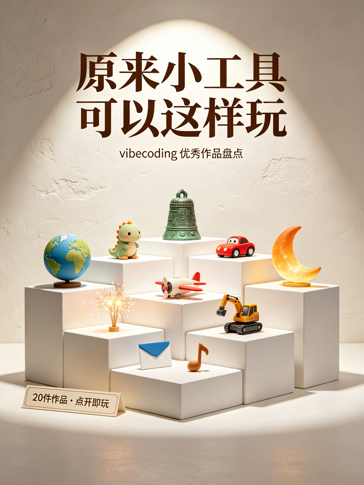
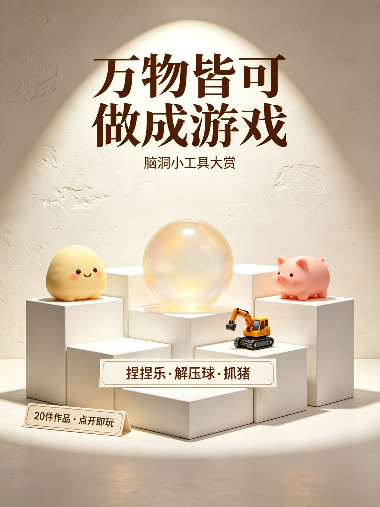
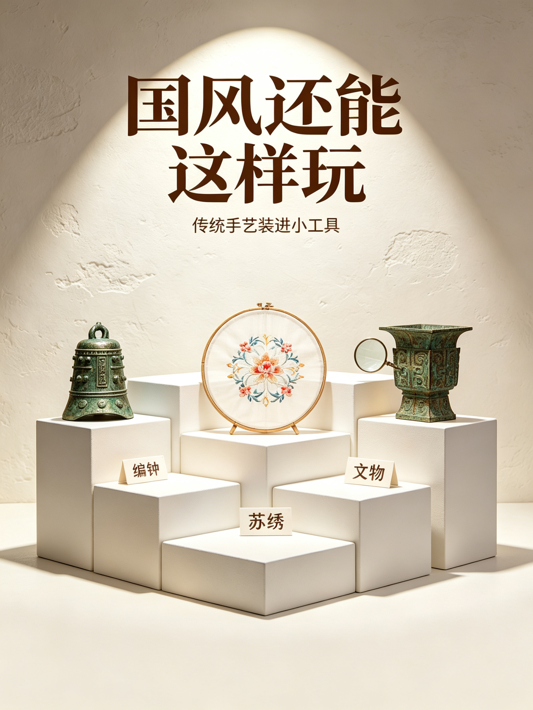
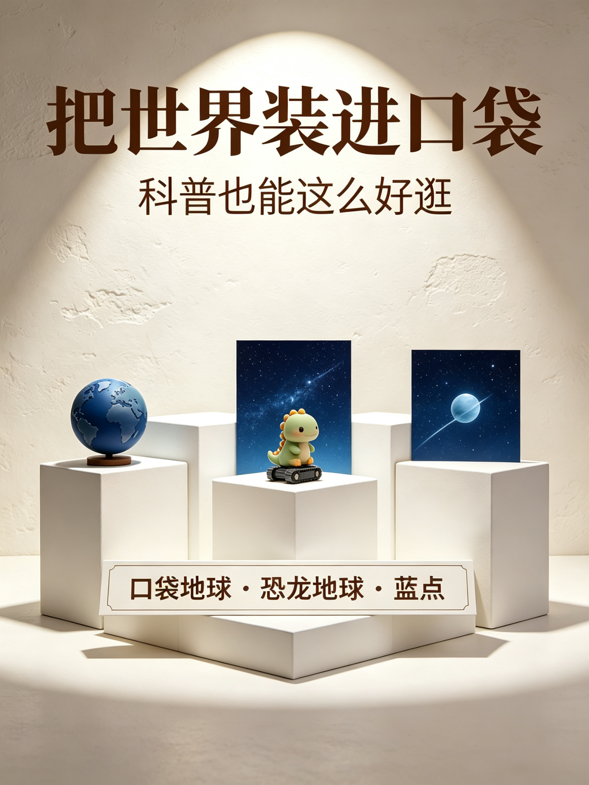
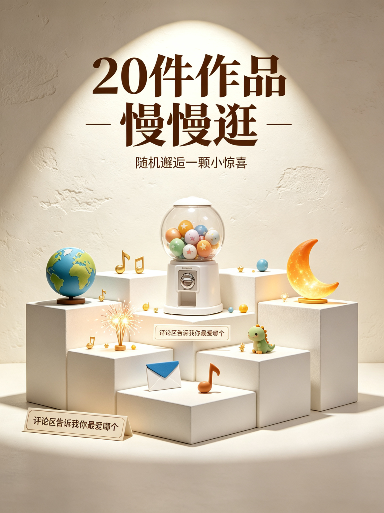

# 小红书图文笔记｜vibecoding 优秀作品盘点

> 归档目录：`vibecoding-gallery/xiaohongshu/`，配图见 `images/` 子目录，均为 3:4 竖版（1536×2048）。
> 素材来源：`vibecoding-gallery/`（20 件作品：17 件归档优秀作品 + 3 件本人作品）。
> 面向小白用户，专注介绍背景与功能，不涉及技术实现。

---

## ✨ 一、笔记标题

**主标题（核心关键词前置，约 20 字符）：**

> vibecoding作品盘点｜原来小工具可以这样玩

---

## 🖼️ 二、笔记配图（共 6 张，杂志展陈风高信息密度介绍图，3:4 竖版）

暖白艺术馆展陈风 6 张（暖白展厅墙 + 白色展台 + 柔和射灯 + 展签说明，每张聚焦一个主题，展品意象取自 20 件作品）：
1. 封面：原来小工具可以这样玩｜vibecoding 优秀作品盘点
2. 背景：不写代码，也能做小工具（vibecoding 是什么）
3. 万物皆可做成游戏：捏捏乐 / 解压球 / 挖掘机抓猪
4. 国风还能这样玩：编钟 / 苏绣 / 文物
5. 把世界装进口袋：口袋地球 / 恐龙地球 / 下一个蓝点
6. 收尾：20 件作品慢慢逛，评论区告诉我你最爱哪个

---

## 📝 三、正文内容（可读版）

**开头钩子（结果+身份）：** 一行代码没写，我把 20 件让我震撼的 vibecoding 小工具收进了同一个小展馆。有些玩的人不多，但每一个都在跟我说：原来小工具可以这样玩。

**1、先说背景：vibecoding 是什么？**

小红书发起的 vibecoding 大赛，核心玩法是「用 AI 编程，把创意做成点开即玩的小工具」。作品直接挂在笔记里，谁都能玩，不用下载、不用安装。小工具是动态、可交互的，所以创意不是一张静态图，而是真的能玩起来。

**2、万物皆可做成游戏**

- 有人把线下火到不行的解压「捏捏乐」搬进手机：饭团、牛角包、小猪……八种捏捏，摸鱼时捏一捏，超解压。
- 有人做了颗果冻质感的大球，可以戳、可以按、可以扒拉，还能上传照片定制属于自己的球。
- 有人把全网热梗「挖掘机抓猪」做成游戏：开挖掘机追猪、抓猪、送回围栏，还听劝连夜改了视角。

**3、国风还能这样玩**

- 有人做了三层编钟，三十秒教会你弹周杰伦的《晴天》。
- 有人把照片「绣」成苏绣，一针一线飞针走线，还能调针法、换丝线颜色。
- 有人把文物搬进手机：360° 旋转、放大看细节，像在博物馆里慢慢逛。

**4、把世界装进口袋**

- 口袋地球：3D 地球科普，昼夜、四季、月相、内部结构都能转出来看。
- 恐龙地球：坐巡逻车逛侏罗纪公园，30 只恐龙、4 条路线，化石发现地都标在地球上。
- 下一个蓝点：从家门口草地一路飞到宇宙边缘，通关条件不是飞最远，是找到一颗有海的星球。

**5、还有这些惊喜**

中秋把没来得及说的话寄给月亮；把你站过的江边、窗边、天台铺进夜空放一场烟花；把月亮的圆缺变成音符弹一首曲子……20 件作品，我都收进了小展馆，双列瀑布流慢慢逛，还有「随机邂逅」扭蛋彩蛋。

**结尾动作：** 你最想玩哪一个？评论区点名，我去把链接翻出来～

---

## ✨ 四、直接复制版本（发布用，直接粘贴到小红书）

一行代码没写，我把 20 件让我震撼的 vibecoding 小工具收进了同一个展馆🔧

有些玩的人不多，但每一个都在跟我说：原来小工具可以这样玩✨

先说背景：小红书 vibecoding 大赛，就是用 AI 编程把创意做成「点开即玩」的小工具，挂在笔记里谁都能玩，不用下载✨

分享几个让我惊呼的作品：

万物皆可做成游戏：
有人把解压「捏捏乐」搬进手机，饭团、牛角包、小猪八种捏捏，摸鱼捏一捏超解压🧸
有人做了颗果冻大球，能戳能按能扒拉，还能上传照片定制自己的球⚪️
有人把全网热梗「挖掘机抓猪」做成游戏，开挖掘机追猪抓猪，还听劝连夜改了视角🚜

国风还能这样玩：
三层编钟，三十秒教会你弹周杰伦的《晴天》🎵
把照片「绣」成苏绣，飞针走线，还能换丝线颜色🧵
把文物搬进手机，360° 旋转放大看，像在博物馆慢慢逛🏛️

把世界装进口袋：
口袋地球：3D 地球科普，昼夜四季月相内部结构都能转出来看🌍
恐龙地球：坐巡逻车逛侏罗纪公园，30 只恐龙 4 条路线🦕
下一个蓝点：从草地飞到宇宙边缘，通关是找到一颗有海的星球🌌

还有把没说的话寄给月亮、把江边铺进夜空放烟花、把月相变成音符……

20 件我都收进小展馆了，瀑布流慢慢逛，还有随机邂逅彩蛋🎁

你最想玩哪一个？评论区点名，我去翻链接～

#小红书vibecoding大赛  #vibecoding  #小红书小工具  #vibegame #vibeknow #vibetool #国风vibecoding #小工具盘点 #AI小工具

---

## 💡 五、标题备选

- **数字型：** ① 20件vibecoding作品，点开就能玩 ② 我收藏的20个小工具，全是惊喜
- **好奇型：** ③ vibecoding还能这样做？我收藏了20件 ④ 原来小工具可以这样玩！我收了20件
- **反常识型：** ⑤ 不写代码也能做小工具？我收藏了20件 ⑥ 一行代码没写，我整理了20个小工具
- **身份型：** ⑦ 一个不写代码的人，收藏了20件vibecoding作品
- **互动型：** ⑧ 逛了20件vibecoding作品，你最想玩哪个？
- **对比型：** ⑨ 从冲量到收藏：我把20件优秀作品放进展馆
- **悬念型：** ⑩ vibecoding作品盘点，我挑出了20件

---

## 🏷️ 六、话题标签备选

**本篇主推标签（9个）：**

#小红书vibecoding大赛  #vibecoding  #小红书小工具  #vibegame #vibeknow #vibetool #国风vibecoding #小工具盘点 #AI小工具

**可替换/叠加备选：**

#vibecoding大赛 #AI编程 #用AI做小工具 #小工具创作 #作品盘点 #优秀作品 #创作者推荐 #零代码 #解压小游戏 #国风小工具 #科普小工具

---

## 🎨 七、封面设计灵感（杂志展陈风）

| 图片 | 设计风格 | 设计思路 |
|---|---|---|
| 封面 | 暖白艺术馆展陈 | 暖白展厅墙 + 白色展台陈列小地球/小恐龙/编钟/赛车/烟花/信封等展品，深棕衬线大字「原来小工具可以这样玩」，副标题「vibecoding 优秀作品盘点」 |
| 内页·背景 | 展陈+信息 | 展台上悬浮手机 + 漂浮小工具图标，标题「不写代码，也能做小工具」，说明 vibecoding 是什么 |
| 内页·万物皆可 | 展陈三件套 | 三个白色展台分别陈列捏捏饭团/果冻大球/挖掘机抓猪，标题「万物皆可做成游戏」 |
| 内页·国风 | 展陈三件套 | 三个展台陈列编钟/绣绷/青铜文物，标题「国风还能这样玩」 |
| 内页·科普 | 展陈三件套 | 三个展台陈列小地球/恐龙巡逻车/星空小星球，标题「把世界装进口袋」 |
| 内页·收尾 | 展陈+彩蛋 | 白色扭蛋机 + 散落小工具图标，标题「20件作品，慢慢逛」，引导评论区互动 |

整组统一暖白艺术馆展厅风、低饱和暖白木色、深棕衬线大字、柔和射灯、大量留白，3:4 竖版，与上一期个人总结笔记同属一套视觉体系。

---

## 💬 八、评论区互动引导

① 置顶：你最想玩哪一个？评论区点名，我去翻链接～

② 首评：小展馆里藏了个「随机邂逅」扭蛋机，摇到谁算谁，要不要试试？

③ 互动：你平时刷到过哪些让你「哇」出声的小工具？评论区互相安利

④ 互动：如果让你做一个点开即玩的小工具，你会做什么？

---

## 📣 附：小红书宣传文案

**版本A·一句话转发语：**
不写代码也能做小工具？我把 20 件震撼到我的 vibecoding 作品收进了同一个展馆，点开即玩，慢慢逛。

**版本B·简介/推广版：**
小红书 vibecoding 大赛优秀作品盘点来啦！20 件点开即玩的小工具：解压捏捏乐、挖掘机抓猪、编钟弹《晴天》、照片变苏绣、3D 地球科普……万物皆可做成游戏，国风也能这么玩。全部收进小展馆，瀑布流慢慢逛，还有随机邂逅彩蛋，评论区点名你最想玩哪个！

**版本C·评论区/私信安利版：**
刚刷到一篇 vibecoding 作品盘点，20 件点开即玩的小工具收进一个展馆，有编钟弹晴天、照片变苏绣、挖掘机抓猪，好奇的话可以去看下。

**版本D·公众号/朋友圈短文案：**
一行代码没写，收藏了 20 件 vibecoding 优秀小工具：捏捏乐、挖掘机抓猪、编钟弹《晴天》、照片变苏绣、3D 地球科普……原来小工具可以这样玩。
