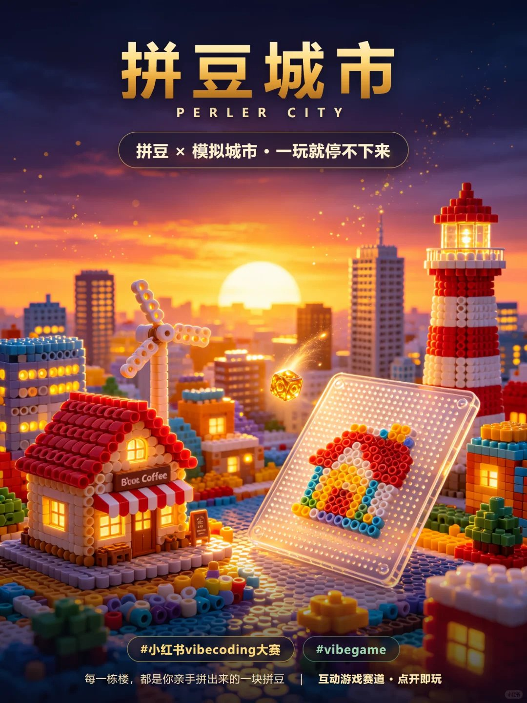
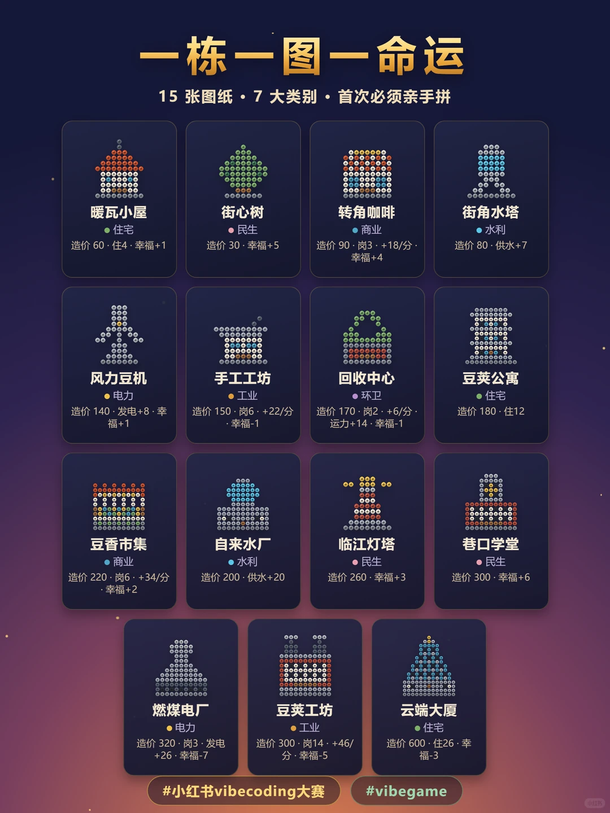
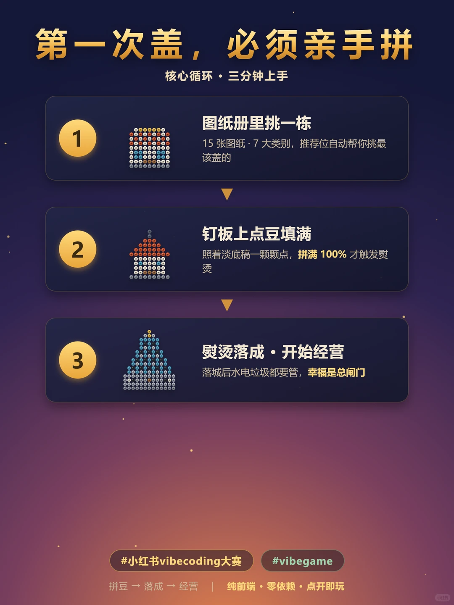
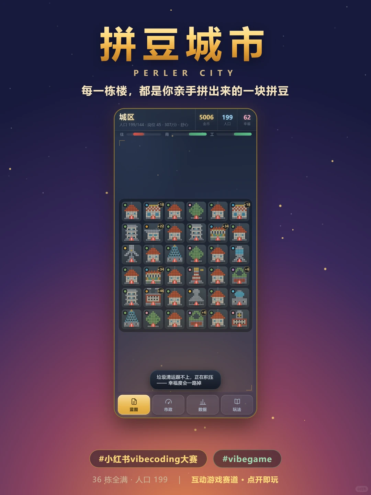

# 拼豆 × 模拟城市？把拼豆玩成一座城！🧩

🧩 每一栋楼，都是一张拼豆图纸。
第一次盖，必须亲手一颗一颗点满钉板；拼满自动「熨烫」落成，那种把一坨豆子变成一座房子的感觉，只有亲手拼过才懂。

🏙️ 落城之后，才是真正的经营。
住宅 / 商业 / 工业三条需求互相拉扯，电、水、垃圾三条管网随时可能爆 —— 停水停电，人真的会搬走；垃圾积压，整座城的幸福一路掉。

💛 幸福是总闸门。
只顾盖楼赚钱、不种一棵树，幸福掉光，实际进账反而更少。怎么取舍，全靠你。

15 张图纸 · 7 大类别，从暖瓦小屋一路盖到云端大厦。

#小红书vibecoding大赛 #vibegame #拼豆 #模拟城市 #vibecoding #小红书小工具 #独立游戏

